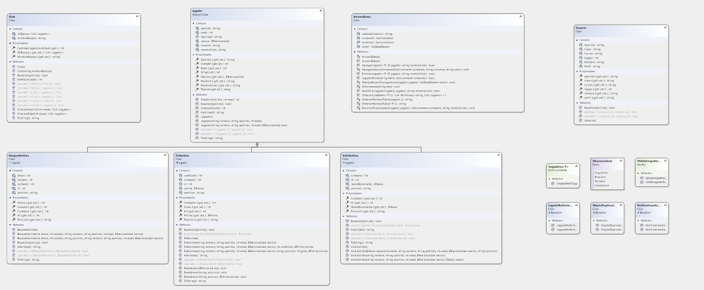
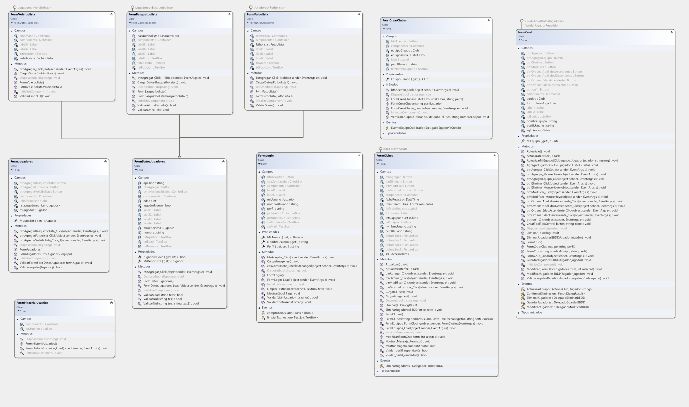

# Gradia.Valentin.PrimerParcial

## CRUD- Club de jugadores
___
## Sobre Mi
**Me llamo Valentin, tengo 18 años y estudio programacion en la UTN. Siempre me gusto la programacion desde chico, en la 
primaria una profesora mia tuvo un incoveniente por lo que pusieron un profesor de la universidad (UAI) a enseñarnos. Vimos access y como proyecto tuvimos 
que hacer una calculadora lo cual me gusto mucho y encontre una relacion por asi decirlo con la programacion. Luego en la secundaria en el ultimo año me anote en
el taller de programacion que nos enseñaron un poco de php y lo basico de base de datos**
___
## Resumen
**La aplicacion se encarga de crear clubes los cuales puedes agregar jugadores, estos pueden ser futbolistas, basquetbolistas o voleibolistas.Tambien se encarga de  modificar sus datos o eliminarlos del equipo. 
No solo eso sino que puedes tambien puedes modificar los equipos en el cual  puedes acceder a estas caracteristicas. Dichos jugadores pueden ser guardados y/O almacenados en una base de datos**

## Diagrama de clases

## Diagrama de Formularios

___

## SQL
**Se utiliza la BBDD para almacenar los tipos de jugadores. De ese modo podras tenerlos guardados y poder obtenerlos en otro club**

## Excepciones
**Se emplean excepciones en diversas secciones del código, en situaciones donde podría surgir un error durante la ejecución o en casos de errores del usuario. 
Por ejemplo, en el proceso de inicio de sesión, se desencadena una excepción controlada si los datos proporcionados por el usuario son incorrectos.**

## Generics
**Se utilizan generics tanto en metodos como en interfaces para poder trabajar con varios tipos de datos con el fin de hacer el codigo mucho mas flexible y
reutilizable, adaptandose a los diferentes datos.**

## Delegados
**Se emplean delegados a la hora de la creacion de eventos tales como confirmar una serie de eliminacion de datos o para actualizar procesos y comprobarlos. Incluso para hacer un CRUD de la base de datos**

## Task
**Se utilizan task para poder agregar y modificar diferentes clubes y no estar agregando y/o modificando club por club. Tambien para poder mostrar una secuencia de imagenes y que la aplicacion no se bloquee**

## Serializacion
**Se emplea el termino serealizacion a la hora de obtener la lista de usuarios que pueden acceder a la aplicacion**

## Eventos
**Se utilizan eventos a la hora de comprobar la contraseña del usuario que este ingresando, lanzar mensajes de dialogos si ocurre algun error. Tambien para invocarlos en determinados momentos como por ejemplo al agregar
jugador al club este automaticamente se guardara en la base de datos**

