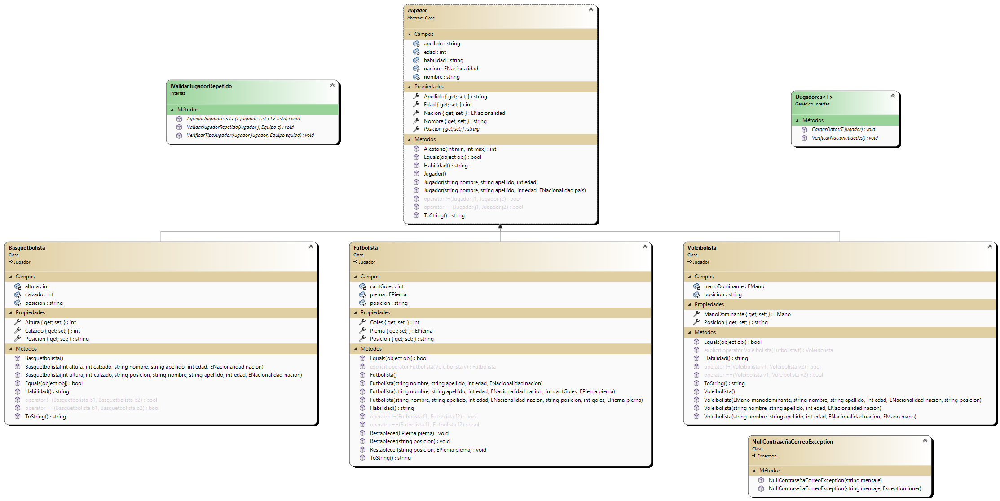

# Gradia.Valentin.PrimerParcial

## CRUD- Equipo de jugadores
___
## Sobre Mi
**Me llamo Valentin, tengo 18 años y estudio programacion en la UTN. Siempre me gusto la programacion desde chico, en la 
primaria una profesora mia tuvo un incoveniente por lo que pusieron un profesor de la universidad (UAI) a enseñarnos. Vimos access y como proyecto tuvimos 
que hacer una calculadora lo cual me gusto mucho y encontre una relacion por asi decirlo con la programacion**
___
## Resumen
**La aplicacion se encarga de crear equipos los cuales puedes agregar jugadores, modificar sus datos o eliminarlos del equipo. No solo eso sino que puedes tambien 
puedes modificar los equipos en el cual  puedes acceder a estas caracteristicas. Dichos jugadores pueden ser guardados y/O almacenados en una base de datos, o si optas 
otra opcion, serealizarlos en archivo JSON**

